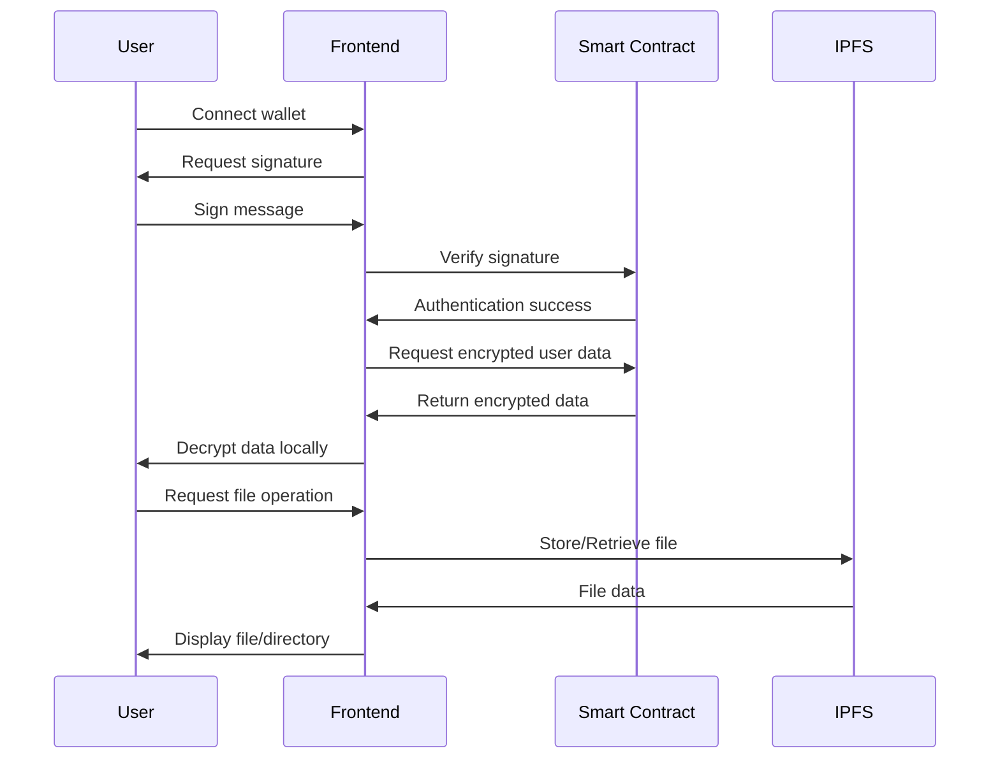

# WebTerm

## Project Concept

This project implements a decentralized, privacy-preserving file system using Web3 technologies, Fully Homomorphic Encryption (FHE), and IPFS. It provides users with a familiar file system interface while leveraging blockchain for authentication and secure metadata storage, and IPFS for decentralized file storage.

### Key Features:

- **Web3 Authentication**: Users connect and sign in using their blockchain wallet.
- **Privacy-Preserving**: Utilizes FHENIX FHE for encrypting user data on the blockchain.
- **Decentralized Storage**: Files are stored on IPFS, with encrypted references on the blockchain.
- **Familiar Interface**: Mimics a traditional file system with directories and files.
- **Access Control**: Supports both public and private files/directories.

## System Flow

The following diagram illustrates the high-level flow of the system:

## How It Works

1. **Authentication**: Users connect their Web3 wallet and sign a message to prove ownership.
2. **Data Retrieval**: Upon successful authentication, encrypted user data is fetched from the blockchain.
3. **Local Decryption**: User data is decrypted client-side using the user's private key.
4. **File Operations**:
   - File metadata and structure are stored on the blockchain using FHE.
   - Actual file contents are stored on IPFS.
   - Encrypted IPFS CIDs are stored on the blockchain.
5. **Access Control**: The smart contract manages file ownership and public/private status.

## Getting Started

- Visit [WebTerm](https://webterm.xyz) and connect your wallet.
- Register to store and access FHE encrypted files.
- Upload files to IPFS and store the encrypted CIDs on the blockchain.
- Setup public or private directories and files. Manage access permissions directly onchain.

## Technologies Used

- Blockchain: FHENIX Helium Testnet
- Smart Contract: Solidity
- Frontend: Next.js
- Fully Homomorphic Encryption: FHENIXs
- Decentralized Storage: IPFS
